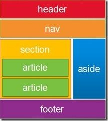

# HTML5-Fun`damentals` 
| Semantic Elements | 
| ----------------- |
| article           | header            |   
| aside             | hgroup            |   
| figcaption        | mark              |     
| figure            | nav               |
| footer            | section           | 
| time              |   
 

- HTML5 shiv is inculed in http://modernizr.com/